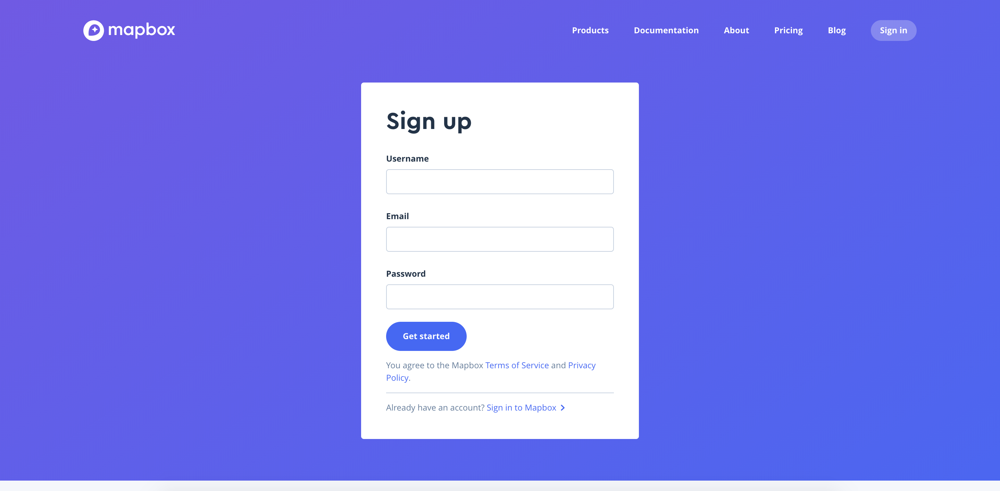
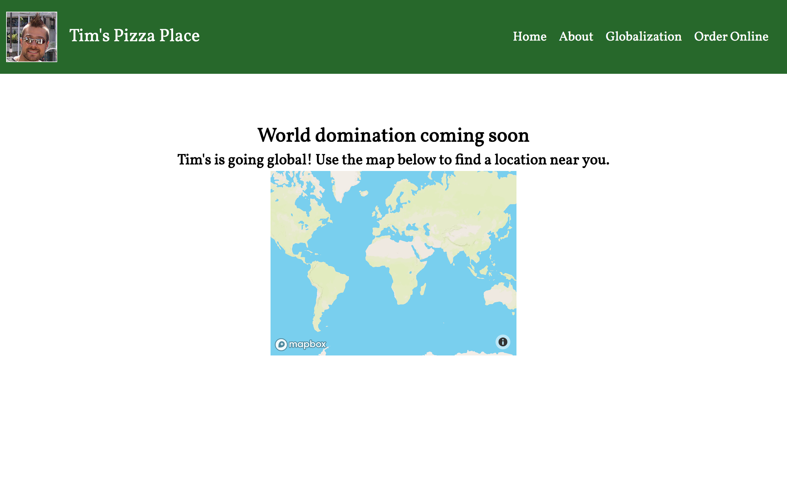
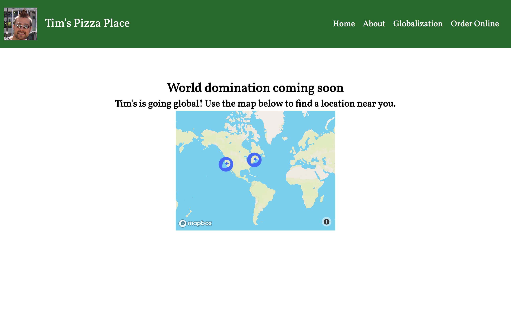
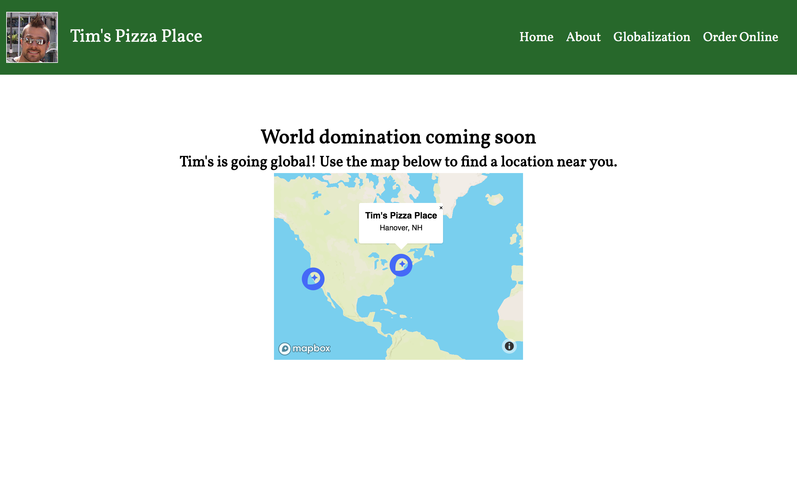
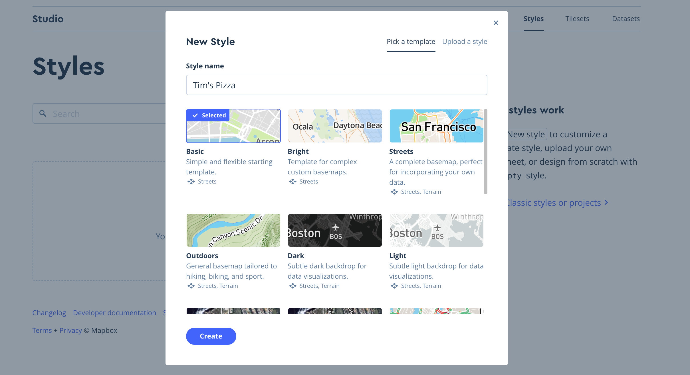
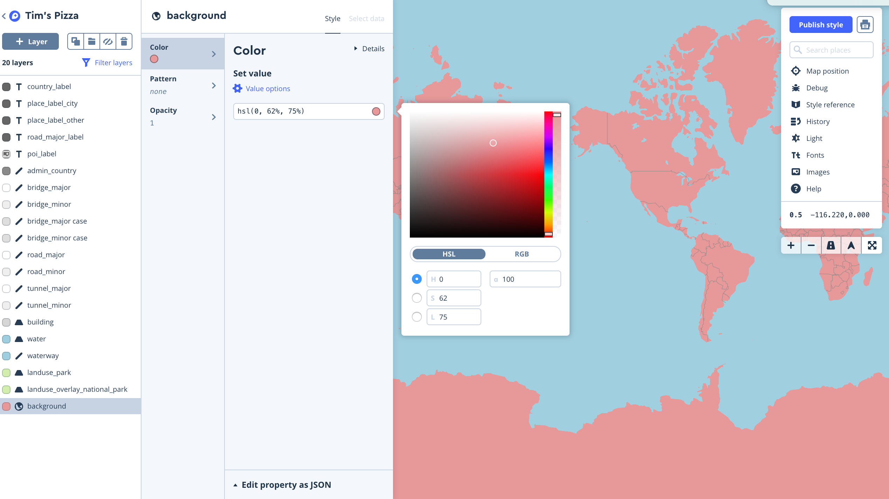
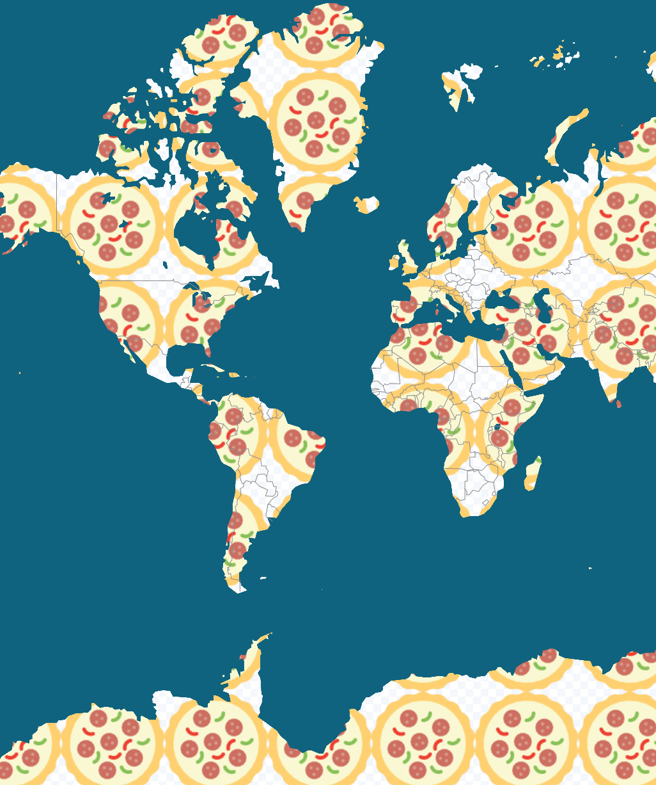
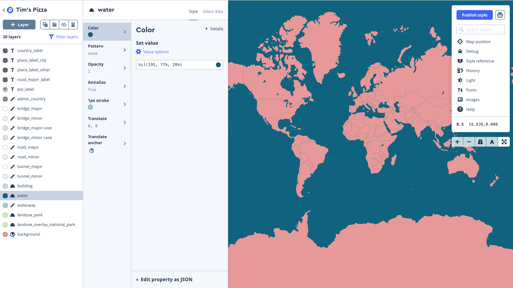
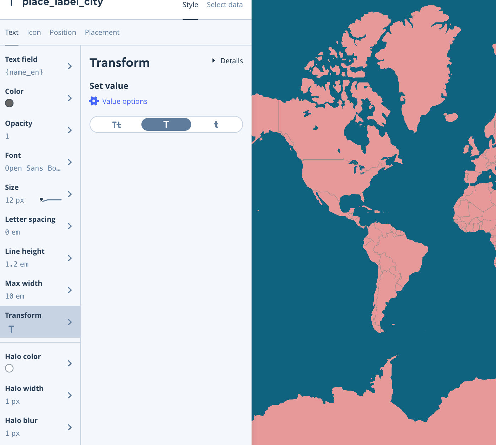
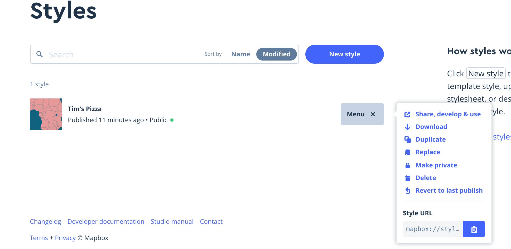

# CS52: A Tutorial for Mapbox!

[](https://www.mapbox.com/gallery/)

Today, we will go over the basics of using mapbox, a JavaScript library mainly used for interactive, customizable maps. The tutorial is based loosely off mapbox's [GitHub repo](https://github.com/mapbox/mapbox-gl-js).

Let's get started!

## Overview

By the end of the workshop, you should have done the following:
* [ ] Make a mapbox account
* [ ] Uploaded a website with integrated Mapbox
* [ ] Customized the map
* [ ] Created a custom style

## Forking the repo

Scroll to the top of this page and fork the repo. We have provided a skeleton of a website that you can insert your map into!

Tim has opened up a pizza place. Let's help him out by inserting a basic map into their website so they can expand globally.

## Creating a mapbox account

First of all, make a mapbox account.

[Make an account](https://www.mapbox.com/signup/)

[](https://www.mapbox.com/signup/)

When you make an account, it should give you your access token. Save this and keep it handy! We will need it later.

Select the `Web Maps SDK` and then select `Use the Mapbox CDN`. You'll be given some lines of code to add to your index.html! They should look like this: 

```html
<script src='https://api.tiles.mapbox.com/mapbox-gl-js/v0.44.2/mapbox-gl.js'></script>
<link href='https://api.tiles.mapbox.com/mapbox-gl-js/v0.44.2/mapbox-gl.css' rel='stylesheet' />
```

## Adding a map to the website!

Remember those two lines of code? Now open up index.html and add them to the `<head>` of your HTML file. This adds a reference to the Mapbox JavaScript and CSS files that you'll need to create your map!

```html
<script src='https://api.tiles.mapbox.com/mapbox-gl-js/v0.44.2/mapbox-gl.js'></script>
<link href='https://api.tiles.mapbox.com/mapbox-gl-js/v0.44.2/mapbox-gl.css' rel='stylesheet' />
```

Add the following code to the body, right under the `<h2>` tag. 

```html
<div id='map' style='width: 400px; height: 300px;'></div>
<script>
mapboxgl.accessToken = 'REPLACE WITH YOUR OWN';
var map = new mapboxgl.Map({
    container: 'map',
    style: 'mapbox://styles/mapbox/streets-v9'
});
</script>
```

**Remember to switch out the accessToken with your own.**

Fantastic, now you have a map embedded in the webpage!

[]()

## Adding a Custom Marker
The MapPlot reads GeoJSON data to create markers on the map. Let's provide our map with some location data for Tim's Pizza Place. 

Add in the following JSON information between the map code you just pasted in and the closing ``` </script> ```. We've already dropped a pin on the first location, but you should pick a second location of your liking. Find GPS coordinates using Google maps. (hint: you may have to reverse the coordinates).

```html
var geojson = {
  type: 'FeatureCollection',
  features: [{
    type: 'Feature',
    geometry: {
      type: 'Point',
      coordinates: [-72.288424, 43.703301]
    },
    properties: {
      title: "Tim's Pizza Place",
      description: 'Hanover, NH'
    }
  },
  {
    type: 'Feature',
    geometry: {
      type: 'Point',
      coordinates: [TODO: LAT, TODO: LONG]
    },
    properties: {
      title: 'Second Pizza Shop Location',
      description: 'Up to you'
    }
  }]
};
```
Now we need to choose an icon for our map marker. We've included an image for you, but feel free to find your own.
Then, add styling for your marker to you ```style.css```:
```html
.marker {
  background-image: url('mapbox-icon.png');
  background-size: cover;
  width: 50px;
  height: 50px;
  border-radius: 50%;
  cursor: pointer;
}
```
Finally, lets include the javascript to read the JSON and display the marker icons. Make sure to add this code after your GeoJSON data and before the ```</script>``` tag. 
```
// add markers to map
geojson.features.forEach(function(marker) {

  // create a HTML element for each feature
  var el = document.createElement('div');
  el.className = 'marker';

  // make a marker for each feature and add to the map
  new mapboxgl.Marker(el)
  .setLngLat(marker.geometry.coordinates)
  .addTo(map);
});
```

[]()

## Adding Popups to our Markers

Popups are a useful way to display marker specific information on your MapBox. We're going to add some to our markers!

First, lets do some styling for our popups in ```style.css```: 

```
.mapboxgl-popup {
  max-width: 200px;
}

.mapboxgl-popup-content {
  text-align: center;
  font-family: 'Open Sans', sans-serif;
}
```
Then, we need to attach our popup to the markers on the map. Lets replace the ```new mapboxgl.Marker``` with the following:

```
new mapboxgl.Marker(el)
  .setLngLat(marker.geometry.coordinates)
  .setPopup(new mapboxgl.Popup({ offset: 25 }) // add popups
  .setHTML('<h3>' + marker.properties.title + '</h3><p>' + marker.properties.description + '</p>'))
  .addTo(map);
```
Congrats! Now you are displaying contextual information on top of your marker.

[]()

## Create a Custom Style
Now we're going to learn how to use MapBox's built in style editor. This will allow us to set custom styles for various parts of the map (i.e., color of water, color of roads, color of buildings, font styles). This is useful for when we want to personalize the way our map looks in our website!

Log onto your newly created MapBox account and go to the "[Styles](https://www.mapbox.com/studio/styles/)" page.

Create a new style (choose "basic") and name it whatever you'd like. We picked `Tim's Pizza` to match the title of our website!

[]()

### Customize Colors

Select the background layer from the layer list and choose a new color.


[]()


EXTRA CREDIT: Play around with the editor and find out how to add an image for the background layer instead of a solid color, like this:


[]()

Follow the same process to edit the water.

[]()

### Customize Fonts

Now we're going to change the fonts!

Click the filter layers buttom at the top of the layers list, filter by value, and select fonts. Choose Opens Sans Semibold in the resutling list and then select it in the layer list, change the value to Open Sans Bold. 

Select the Text Transform button and chagne the fonts to "All Uppercase"

[]()

### Exporting your custom style

When you have all the changes you want to make to your style, select "Publish Style" in the upper right corner. 

Go to mapbox.com/studio/styles and grab the URL for your style. Make sure you change it to public access.

[]()

In your map code, change the style code (mapbox://.....) to the URL you copied.


Congrats! You've made your first custom map with MapBox!

## Deployment
Make sure you are in the correct directory and type ```surge``` to deploy your new webpage!

NOTE: We're assuming you already have surge installed, if not you will have to type ```npm install -g surge```and then sign up for surge!

## Summary / What you Learned

* [X] Make a mapbox account
* [X] Have a website with integrated Mapbox
* [X] Add custom markers to map
* [X] Attach marker-aware popups
* [X] Create a custom style and apply it to a map

## Really liked this tutorial? Want to learn more? Here are some extra credit ideas: 
* Add an image as the background of your map in the Style editor (see the image in the `Create a Custom Style` section)
* Add a store locator to let users browse all locations of Tim's Pizza (hint [here](https://www.mapbox.com/help/building-a-store-locator/))

### To submit on Canvas
* [X] Surge url to your deployed site!      
* [X] (Optional) Any extra credit attempts      

## Resources

Our tutorial is based off of Mapbox Tutorials (https://www.mapbox.com/help/tutorials/)
* Creating a Mapbox GL JS map
* Add HTML Markers
* Add Popups
* Creating a Custom Style
